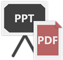
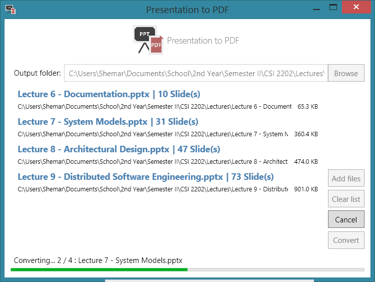

 
# Presentation to PDF

## Project Description

A simple ppt / pptx to PDF converter that converts PowerPoint presentations in batch.

## Built with:
* C#
* WPF

## Features:
* MS PowerPoint presentations (ppt & pptx) to PDF.
* MS Word documents (doc & docx) to PDF
* Batch conversion.

## Requirements:
* Microsoft Office (PowerPoint needed)
* Microsoft's .NET Framework 4.5 or later (comes with most Windows systems)

## Links:
* .NET Framework: [http://www.microsoft.com/en-us/download/details.aspx?id=40773](http://www.microsoft.com/en-us/download/details.aspx?id=40773)

